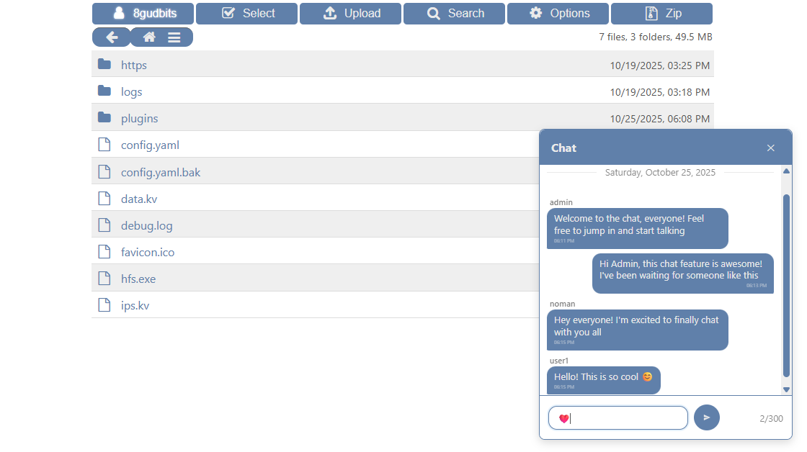
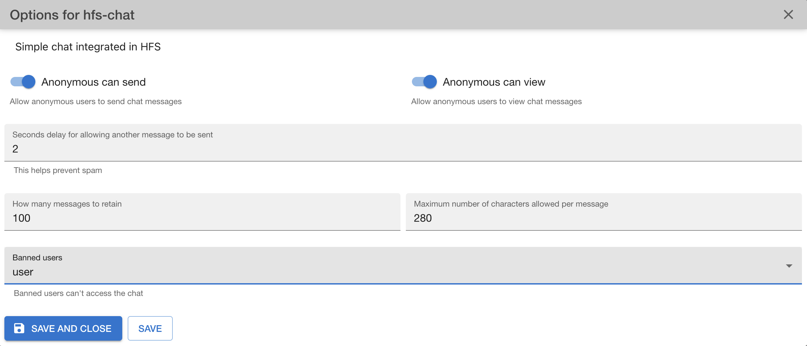

# HFS Chat-Plus

**Welcome to HFS Chat-Plus!** This plugin enables a chat system to let users chat on your HFS server.

> This plugin is a modified version of [damienzonly/hfs-chat](https://github.com/damienzonly/hfs-chat) v1.4. This fork includes significant changes not present in the upstream repository.

## Core Features

- **Anonymous Chat**: Users can chat anonymously with configurable send and receive permissions.
- **Spam Prevention**: Implement time delays between messages to prevent spam from the same IP/user.
- **Message Limit**: Set a maximum number of messages to be stored in the database.
- **Ban Management**: Maintain a list of banned users who are restricted from accessing the chat.
- **Character limit**: Limit the maximum allowed characters per message to ensure concise communication.

## Styling

The chat design inherits the style from the standard theme CSS, ensuring a consistent look and feel. All CSS classes are defined in the `style.css` file. If you want to customize the style, you can edit this file directly or create a new plugin to override the CSS rules of the chat plugin.

In addition to the `.msg` CSS class, every message has an additional class `.msg-anon` for guest's messages and `.msg-user` for logger users messages.

## Contribute

Pull requests and suggestions welcome. If you find a bug, have an idea, or want to improve something—open an issue or submit a PR. All contributions will be reviewed.

Have fun!

